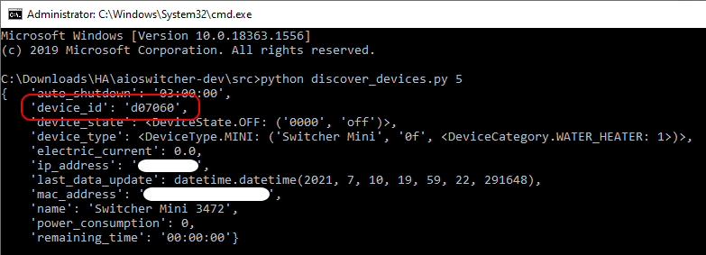

# Discover Switcher Devices Info

1. Install latest Python (Currently 3.9).
2. Install "aioswitcher" module with the below command.
```
pip install aioswitcher
```
3. Download the [script](https://github.com/TomerFi/aioswitcher/blob/dev/scripts/discover_devices.py).
4. Run the following command from the folder you put the script, this will run the discovery for 30 seconds.
```
python discover_devices.py 30
```

> Make sure you are on the same network as the devices.   
> Also make sure Windows Firewall is disables while running the discovery command.

Should look like this:



